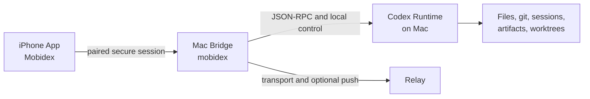
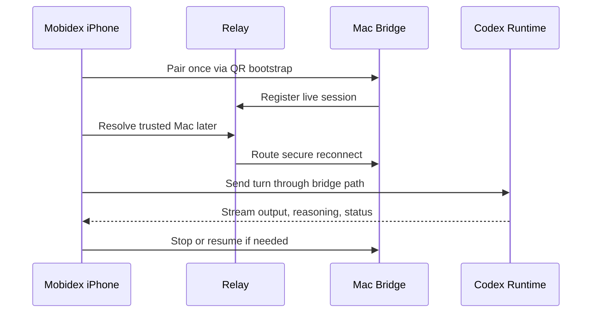
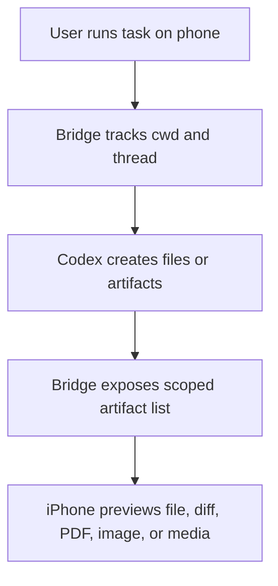
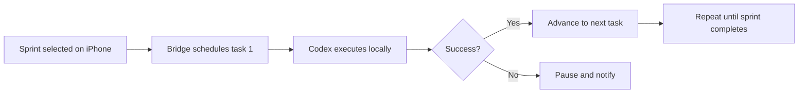

# Mobidex Project Progress Recap

This document summarizes the major discussions, decisions, and shipped progress for this project so far. It is written as a founder-facing recap of what the product has become, what work has already landed, and what operating rules now define the system.

## What this project became

The project started as a fork/white-label evolution of Remodex/CodexMobile and has been shaped into **Mobidex**, a local-first iPhone control surface for a Mac-hosted Codex runtime.

The core product decision has stayed consistent:

- The **iPhone is the controller**
- The **Mac bridge is the runtime owner**
- The **relay is transport and optional push plumbing**
- The **Codex runtime, files, git state, and session history stay on the Mac**

That matters because the real product is not just "chat on a phone." The real product is secure pairing, trusted reconnect, local execution, operational control, and safe access to a developer's real machine from an iPhone.

## Phase 1: Establishing the local-first foundation

The first major body of work was clarifying that this product should not drift toward a hosted SaaS architecture.

What changed:

- The repo and docs were reshaped around a **local-first model**
- Hosted-service assumptions and hardcoded production-style thinking were treated as regressions
- The runtime responsibilities were separated clearly between phone, Mac bridge, and relay
- Self-hosting guidance was reviewed through the lens of private, practical operation rather than public-cloud complexity

The operating logic became:

- The phone should never become a fake server
- The relay should never become a hosted Codex brain
- The Mac should remain the place where execution, local context, session history, and git authority live

In real-world terms, this means Mobidex behaves more like a secure remote control for your own workstation than a thin client for somebody else's backend.

## Phase 2: White-labeling Remodex into Mobidex

The second major track was productization.

What changed:

- Remodex was white-labeled into **Mobidex**
- Product naming, bundle identity, npm packaging, relay naming, docs, and local launcher flows were adapted
- The Fly relay deployment path was prepared and verified
- The iOS app identity and TestFlight/App Store Connect footprint were aligned with the Mobidex brand

What mattered strategically:

- This was not treated as a cosmetic rename
- Branding, package identity, bundle identity, local launch ergonomics, and deploy surface were handled as one connected product surface
- Visible naming could change, but secure wire-format compatibility had to remain stable so pairing would not break

That last part was important. A previous rename attempt broke pairing because the phone and bridge stopped agreeing on the secure transcript tags. From then on, the rule became:

- Keep visible product naming as Mobidex
- Keep legacy protocol tags stable until every participating component is migrated together

## Phase 3: Hardening pairing, reconnect, and timeline behavior

Once the product identity was established, a major focus became reliability of the control experience.

What changed:

- Pairing and trusted reconnect flows were protected
- Saved relay pairing and local connection state were treated as the source of truth
- Reconnect behavior across relaunch/backgrounding was preserved
- Timeline handling was hardened so late reasoning and turn events would merge correctly instead of creating confusing duplicate or flattened UI rows
- Stop behavior was guarded even when a usable `turnId` was missing

The logic behind this work:

- A remote-control product fails emotionally before it fails technically
- If the phone cannot reliably reconnect, stop a task, or show a faithful timeline of what happened, the user stops trusting the system

In operational terms, this work made the system behave less like a fragile stream and more like a resilient operator console.

## Phase 4: Multi-Mac / multi-device product direction

Another major design thread was how one iPhone should control multiple Macs safely.

What was decided:

- Mac identity is a first-class product concept, not an implementation detail
- Chats, persistence, routing, reconnect behavior, and device settings should be scoped to the selected Mac
- The system should support explicit switching rather than muddled shared-state behavior

What shipped conceptually:

- The product direction solidified around Mac-scoped persistence, device-aware navigation, and safe switching
- Reference PRs were studied for architecture, but not merged blindly because they carried unrelated baggage and risked history leakage between Macs

In business-process terms, this is the difference between a receptionist who knows which office they are routing a call to and one who just forwards messages into a pile.

## Phase 5: Voice and dictation reliability

Voice was treated as a core product workflow rather than a novelty feature.

What changed:

- The system was redesigned around **not losing the recording**
- Local audio preservation became more important than transcription success
- The intended experience included durable audio segments, session history, retry, copy, and delete flows
- Longer sessions and operational reliability were treated as primary goals

The governing principle became:

- Transcription can fail and recover
- The user's spoken input should not disappear just because a network or relay event went wrong

That changed the product from "tap to transcribe" into something closer to a reliable field-capture tool.

## Phase 6: Runtime-authoritative capability center

One of the most important architectural shifts was deciding where capabilities should truly live.

What changed:

- Skills, plugins, apps, MCP servers, and custom subagents were reorganized under a **runtime-authoritative capability model**
- The Mac runtime became the source of truth for what can actually be invoked
- The iPhone became the place where those capabilities are viewed, selected, and controlled

Why this matters:

- The phone should not invent capabilities it cannot enforce
- The Mac is where Codex actually runs, so the Mac must own the real inventory

In real operation, this means the phone is acting like a command console for a machine that advertises its actual tools, not like a detached UI guessing what might exist.

## Phase 7: Artifact and file viewing

Another major product step was making outputs tangible.

What changed:

- A bridge-scoped artifact API and iOS file viewer were added
- Generated files, workspace artifacts, previews, and diffs became accessible from the phone
- The design stayed conservative by scoping access to the active workspace and thread

This was an important product decision because it converted Mobidex from "I can send prompts" into "I can inspect what my runtime actually produced."

The safety model was equally important:

- The bridge resolves the active workspace
- The viewer stays scoped to that workspace and thread
- External arbitrary paths were intentionally deferred instead of opening the door too early

## Phase 8: Composer invocation for plugins, skills, files, and subagents

The input experience was expanded so the phone could invoke richer Mac-side behaviors.

What changed:

- Composer support was added for plugins, skills, files, and subagents
- The mention and invocation experience was unified around Mac-side capability metadata

This matters because it moves the phone from simple prompt entry toward structured command composition. The user is no longer just typing at the system; they are assembling a directed request against known runtime resources.

## Phase 9: Loop controls and operator steering

Mobidex was also pushed toward being an active operations console for long-running work.

What changed:

- Loop-control foundations were added with stop hooks, bridge-side policy, and iOS mode controls
- Retry policies such as retry-once, retry-twice, or persistent loop behavior were introduced as product concepts

The architecture rule that emerged:

- Loop policy belongs in the bridge/app layers
- The relay should never own orchestration behavior

This is strategically important because it keeps control close to the runtime and prevents the transport layer from becoming a second brain.

## Phase 10: Sprint Runner and task orchestration

One of the biggest feature leaps was adding **Sprint Runner**.

What changed:

- Sprint Runner was implemented as a bridge-owned orchestration system
- The iPhone gained a sprint/task control surface
- Sequential execution, local persistence, pause-on-failure behavior, and completion/failure monitoring became part of the product

The design intent was very deliberate:

- V1 should be sequential
- One task at a time
- Bound to the selected repo/worktree
- Pause on failure
- No surprise auto-commit, auto-push, or auto-merge behavior

This positions Mobidex as a serious remote operations surface for Codex work, without pretending to be a fully autonomous cloud orchestrator.

## Phase 11: Removing the paywall without removing the product

Another major project decision was to remove the paywall while preserving all real functionality.

What changed:

- RevenueCat / StoreKit paywall gates were removed
- Root access gating was removed
- Previously gated app functionality was kept available under free usage

What mattered in the approach:

- This was treated as an **access-control removal exercise**, not a feature deletion exercise
- The work was audited feature-by-feature to ensure payment-only code was removed without silently stripping useful capabilities

In practical terms, the onboarding and pairing experience remained, runtime controls remained, git remained, voice remained, subagents remained, and the app kept functioning as a complete product instead of a hollowed-out free shell.

## Phase 12: Diagnostics, observability, and bridge health

As the product expanded, reliability work also moved into instrumentation.

What changed:

- Bridge diagnostics and relay health counters were added
- iOS timing and reconnect metrics were introduced
- Protocol guard tooling was added to catch accidental contract drift
- Keep-awake / background-service behavior was treated as a first-class operational concern

This is what turns a promising tool into an operable one. Once users depend on long-running bridge behavior, performance and health signals stop being “nice to have” and become management information.

## The strategic through-line across all work

Looking across all phases, the project did not evolve randomly. A very clear doctrine emerged:

1. **Local-first over hosted-first**
2. **Mac runtime authority over phone-side guesswork**
3. **Transport relay over hosted orchestration**
4. **Reliable pairing and reconnect over flashy thin-client behavior**
5. **Practical control surfaces over theoretical feature breadth**
6. **Feature preservation over careless cleanup**
7. **Open-source quality over one-off hacks**

That doctrine is now embedded in the repo guardrails, release runbook, and feature architecture.

## What has already been proven

The project has already moved beyond concept-stage discussion in several important ways:

- Mobidex branding, package identity, relay identity, and iOS identity were established
- Local-first architecture was documented and enforced
- The Fly relay path was deployed and health-checked
- iOS simulator builds were used as proof gates for major feature work
- Bridge and relay tests were repeatedly used to validate touched areas
- Multiple major product surfaces now exist beyond chat alone: voice, artifacts, subagents, plugins, loop controls, Sprint Runner, git actions, and runtime settings

## What the founder can now do or verify

Today, the founder can reason about Mobidex as a product with these concrete properties:

- It is a **local-first remote control surface** for Codex on a Mac
- It already has a coherent identity as **Mobidex**
- It supports a serious product direction around **pairing, reconnect, multi-Mac control, file/artifact visibility, voice reliability, and task orchestration**
- The paywall has been removed without intentionally hollowing out the core experience
- The relay remains deliberately constrained so the product does not accidentally mutate into a hosted runtime

Verification points that matter operationally:

- `mobidex up`
- `mobidex status --json`
- Relay health endpoint
- npm bridge version
- iOS build number / TestFlight state
- Presence of artifact viewing, runtime capability controls, loop controls, and Sprint Runner in the app surface

## Decisions and tradeoffs that still matter

Several product choices are now settled enough to guide future work:

- **Do not move orchestration into the relay.**
  The relay should stay transport-focused.

- **Do not break legacy secure protocol tags casually.**
  Wire compatibility is more important than naming purity until a full coordinated migration exists.

- **Do not let the phone become the source of truth for runtime capabilities.**
  The Mac must stay authoritative.

- **Do not broaden file/artifact access without a deliberate safety model.**
  Workspace-scoped access is the current safety boundary.

- **Do not trade reliability for convenience in voice or reconnect flows.**
  Preserving user input and trusted control matters more than superficial smoothness.

- **Do not reintroduce hosted-service assumptions in docs or implementation.**
  The local-first thesis is now part of the product identity.

## Summary in one sentence

Mobidex has progressed from a white-labeled fork concept into a local-first, operationally serious iPhone control system for a Mac-hosted Codex runtime, with meaningful advances in identity, pairing, reconnect, voice reliability, runtime capabilities, artifacts, orchestration, and free-access product readiness.
