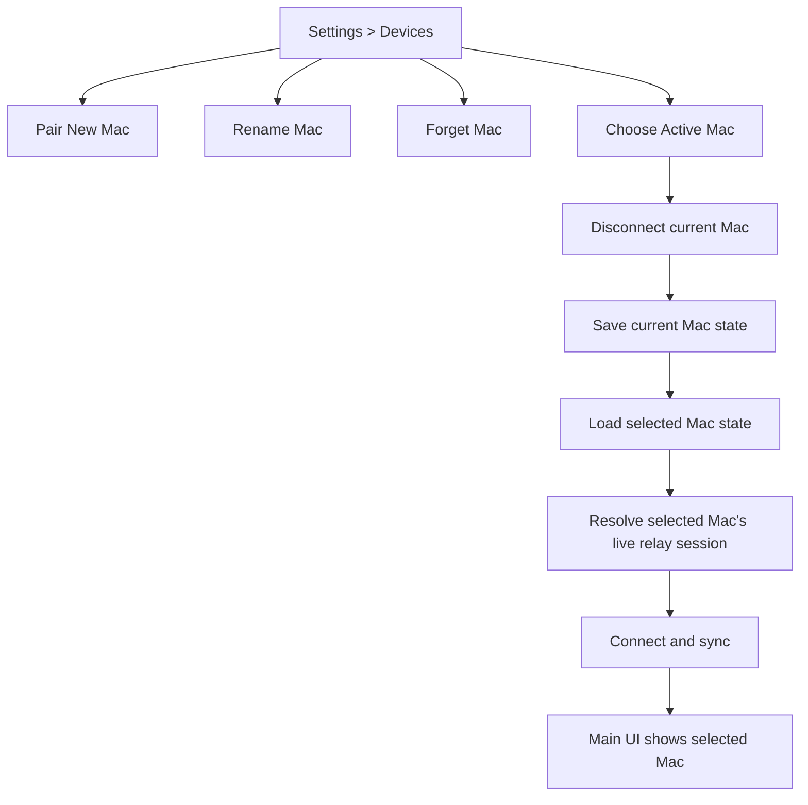
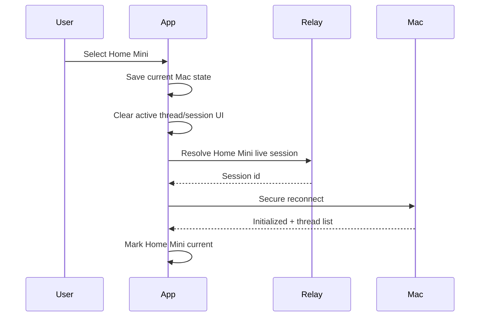
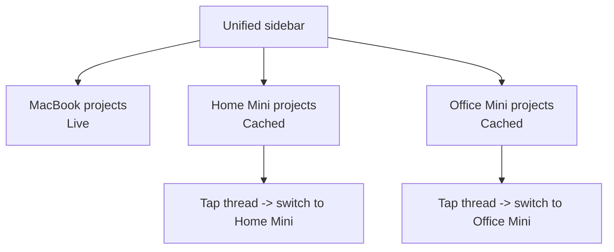

# Multi-Device Sync Implementation Plan

Date: April 20, 2026

## Purpose

This plan turns the multi-device vision into an implementable path for this fork.

The primary goal is multi-Mac control from one iPhone:

- pair multiple Macs
- give each Mac a friendly name and visual identity
- switch between Macs safely
- prevent chats, project state, approvals, and local caches from leaking across devices
- eventually show multiple devices/projects in one unified interface with badges or colors

This plan also evaluates two upstream PRs:

- PR #63: Add explicit multi-Mac pairing and switching to iOS
- PR #57: Support multiple trusted iOS devices

## Product Model

The clean product model is a device manager with a safe active-device core.

The first production version should keep one active Mac connection at a time. That is the lowest-risk path and matches the app's current architecture. A later version can add a unified cached sidebar across devices, then true simultaneous multi-Mac connections if the product still needs it.

## PR Evaluation

### PR #63: Multi-Mac Switching

Verdict: use as a reference, not as a direct merge.

What it solves:

- introduces an explicit selected Mac identity
- adds Mac-scoped local state loading and saving
- adds a `My Macs` management surface
- reconnects by target Mac instead of by whichever Mac was last used
- models switching as a hard context transition
- adds tests for current-vs-last Mac selection and switch recovery

What to reuse:

- selected/current Mac concept
- target-aware trusted reconnect
- Mac-scoped persistence coordinator
- switch rollback and cancellation model
- test cases around state isolation and failed switches

What not to merge directly:

- Apple signing team and bundle identifier changes belong to the PR author's environment, not this fork
- the relay Node/npm engine pin is unrelated to multi-device support
- legacy unscoped cache fallback can leak old local history into a newly paired Mac
- `Forget Mac` removes trust but does not delete that Mac's local cached data
- the implementation remains single-active and does not deliver a true multi-device aggregate feed

Use PR #63 as a donor branch for ideas and tests. Do not merge it wholesale.

### PR #57: Multiple Trusted iOS Devices

Verdict: do not use for the first multi-Mac implementation.

What it solves:

- one Mac can trust more than one iPhone
- a new QR pairing no longer evicts the previous iPhone
- relay trusted-session resolve accepts any phone in the trusted list

Why it is not the same problem:

- Ansar's target use case is one iPhone controlling multiple Macs
- PR #57 is many iPhones controlling one Mac
- it does not add Mac selection, per-Mac state, device UI, or multi-Mac reconnect logic

Risks if merged too early:

- old iPhones remain trusted until all pairing state is reset
- there is no per-phone revoke UI
- there is no per-phone expiry or audit trail
- the "newest phone" compatibility header can be wrong because object update order is not the same thing as pairing recency

Keep PR #57 as a later optional enhancement if this fork wants iPhone + iPad + secondary device control of the same Mac.

## PR Adoption Path

Do not merge either PR directly into this fork.

Recommended path:

1. Create a new implementation branch from this fork's current `main`.
2. Keep PR #63 checked out in a temporary reference worktree.
3. Port the selected-Mac model first, not the UI first.
4. Port the Mac-scoped persistence coordinator, but replace its permanent legacy fallback with one-time migration.
5. Port the target-aware reconnect logic.
6. Port the tests that prove current-vs-last Mac selection and failed-switch rollback.
7. Build our own Devices UI around the fork's design language and branding.
8. Leave out PR #63's Apple signing, bundle identifier, and relay engine changes.
9. Leave PR #57 out of the first milestone.

The practical donor map from PR #63 is:

| Area | Use | Modification Required |
| --- | --- | --- |
| selected current Mac | yes | rename and centralize around a device profile concept |
| Mac-scoped persistence | yes | one-time migration only, no permanent legacy fallback |
| target-aware reconnect | yes | integrate with this fork's current reconnect guardrails |
| My Macs UI | partial | adapt to Settings > Devices and add nickname/color/delete-data actions |
| switch cancellation | yes | keep, but make copy and state transitions match product language |
| tests | yes | port and expand |
| Xcode signing changes | no | exclude entirely |
| relay engine pin | no | exclude unless deployment platform requires it |

## Recommended Roadmap

### Phase 1: Device Profile Foundation

Goal: make a paired Mac a first-class profile.

Build:

- `currentTrustedMacDeviceId` as the explicit active target
- profile list from the existing trusted Mac registry
- stable profile fields: Mac id, relay URL, identity public key, display name, nickname, color, last paired, last used, last resolved session
- one migration from old `lastTrustedMacDeviceId` behavior into explicit current-device behavior
- clear helper APIs for selecting, renaming, forgetting, and resolving a Mac

Acceptance:

- pairing a second Mac does not destroy the first Mac profile
- app launch knows which Mac is selected
- trusted reconnect resolves the selected Mac, not the most recent Mac
- UI can show all paired Macs

### Phase 2: Device-Scoped Persistence

Goal: prevent state leakage across Macs.

Scope these by Mac id:

- message history
- AI change sets
- locally archived and deleted thread ids
- renamed thread titles
- fork origins
- managed worktree associations
- thread runtime overrides
- plan-mode session sources
- GPT account/login snapshot
- pending notification thread routing

Migration rule:

- allow the old unscoped cache to migrate only once into the currently selected Mac
- do not use permanent fallback from every new Mac to the old unscoped cache
- write a migration marker so a newly paired Mac starts empty until it syncs from its own runtime

Forget rule:

- "Forget Mac" should remove trust only
- "Forget Mac and Delete Local Data" should also remove that Mac's local cache namespace
- UI copy must be precise about which action is happening

Acceptance:

- Mac A threads never appear after switching to Mac B
- a fresh Mac does not inherit old cached history
- deleting a Mac's local data removes its cached threads and AI change sets
- switching away during a failed connect restores the previous Mac's visible state

### Phase 3: Safe Single-Active Switching

Goal: one active Mac at a time, with explicit switch progress.

Flow:

Build:

- explicit switching task state
- cancel switch action
- failed-switch rollback
- target-aware reconnect URL resolution
- switch by existing profile
- switch by newly scanned QR
- interrupt or block switching while a run is active

Acceptance:

- offline target Mac fails clearly
- cancellation leaves no ambiguous half-connected state
- previous Mac can be reselected immediately
- saved relay session for Mac A is not reused for Mac B

### Phase 4: Devices UI

Goal: expose the model in a way Ansar can use daily.

Build:

- Settings > Devices screen
- Add New Mac action
- Mac rows with nickname, system name, fingerprint, status, last used, color badge
- rename device
- forget device
- optional delete local data
- switch device
- active device chip/dropdown in the sidebar or top bar

Recommended first UI:

- Settings owns full device management
- Sidebar/top bar shows active Mac and opens the device picker
- Main chat view remains focused on one active Mac

Acceptance:

- Ansar can pair MacBook, Home Mini, and Office Mini
- each has a nickname and visual marker
- switching is obvious and reversible
- current device is always visible in the UI

### Phase 5: Hybrid Multi-Device Sidebar

Goal: show multiple device/project groups without maintaining multiple live sockets.

This is the best middle ground between the simple PR #63 model and the full multi-connection vision.

Model:

- one active live Mac connection
- all paired Macs can show cached project/thread groups
- inactive Macs are visually marked as cached/offline
- tapping an inactive Mac thread switches to that Mac, reconnects, and opens the thread

Build:

- `DeviceThreadKey` made of Mac id + thread id
- sidebar groups by device, then project
- device badge/color on project groups and thread rows
- cached/live status labels
- safe open behavior for inactive-device threads

Acceptance:

- main UI can show all paired device project groups
- only one device is live at a time
- tapping a cached thread from another device switches safely
- no thread id collisions can cross devices

### Phase 6: True Simultaneous Multi-Mac Connections

Goal: multiple live Macs connected at the same time.

This is a larger architecture change and should not be the first implementation.

Required model:

- `DeviceConnectionCoordinator`
- one service/connection runtime per active Mac
- one WebSocket and secure session per selected Mac
- per-device sync loops
- per-device pending approvals
- per-device running indicators
- global UI keyed by Mac id + thread id

Use this only if hybrid sidebar is not enough.

Cost:

- substantially higher concurrency risk
- more battery/network usage
- harder notification routing
- more complex UI mental model
- significant refactor of singleton `CodexService`

Recommendation:

- defer until after single-active switching and hybrid cached sidebar are proven

## Implementation Sequence

### Sprint 1: Foundation and Safety

- add selected Mac profile state
- migrate current/last trusted Mac behavior
- add unit tests for explicit selected Mac
- add target-aware trusted reconnect
- add one-time persistence migration marker

Deliverable:

- app can remember multiple Macs internally and reconnect to the selected one

### Sprint 2: Scoped State

- namespace message and AI change-set persistence
- namespace thread metadata defaults
- prevent permanent legacy fallback
- add forget/delete-local-data behavior
- add tests for no cross-Mac leakage

Deliverable:

- switching target cannot show the wrong Mac's local state

### Sprint 3: Device Management UI

- add Devices/My Macs screen
- add device nickname and color
- add QR pair/update flow from Devices
- add switch, cancel, failure, and previous-state UI
- add active device chip/dropdown

Deliverable:

- Ansar can pair and switch between MacBook, Home Mini, and Office Mini

### Sprint 4: Hybrid Unified Sidebar

- create device-aware sidebar model
- group cached device/project/thread data by Mac
- badge rows by Mac
- switch when opening an inactive Mac thread

Deliverable:

- main UI can show projects from multiple devices while keeping one live connection

### Sprint 5: Optional Multi-iPhone Trust

- revisit PR #57 only if needed
- add trusted-phone registry with metadata
- add per-phone revoke support
- add max trusted devices and pairing timestamps
- fix legacy primary phone ordering

Deliverable:

- one Mac can safely trust multiple iPhones/iPads

### Sprint 6: Optional Simultaneous Live Connections

- introduce connection coordinator
- decide how many devices can be live at once
- add per-device approvals and running state
- add resource/battery guardrails

Deliverable:

- multiple Macs can stream live into one iPhone UI

## Testing Strategy

Do not rely on full simulator testing for every small change. The repo guardrail says Xcode tests should only run when explicitly requested.

Run by default:

- focused Swift unit tests for profile selection and persistence helpers when feasible
- bridge Node tests for relay/trust changes
- relay Node tests for trusted-session behavior
- manual local pairing with `./run-local-remodex.sh`

Manual verification matrix:

- pair Mac A
- pair Mac B
- rename both
- switch A to B
- switch B to A
- switch to offline Mac
- cancel a slow switch
- start a run, attempt switch, confirm safe handling
- confirm Mac A threads do not appear under Mac B
- forget Mac B but keep local data
- delete Mac B local data
- relaunch app and verify selected Mac persists

## Key Decisions For Ansar

Decision 1: first version should be single-active switching or true simultaneous connections.

Recommendation: single-active switching first, then hybrid cached sidebar.

Decision 2: whether Settings is the only device manager or sidebar/top bar also has a quick picker.

Recommendation: Settings/Devices for management, sidebar/top bar for quick switching.

Decision 3: whether forgetting a Mac should delete local cached chats.

Recommendation: split into two actions so trust removal and local data deletion are explicit.

Decision 4: whether to support multiple iPhones per Mac now.

Recommendation: no. Defer PR #57 until the multi-Mac model is stable.

Decision 5: whether unified sidebar should include offline cached devices.

Recommendation: yes. This gives most of the product value without the cost of simultaneous live sockets.

## Final Recommendation

Use PR #63 as the reference model for selected-Mac switching, but port it deliberately rather than merging it.

Do not use PR #57 for the first multi-device milestone. It is a later shared-device enhancement.

The first production milestone should be:

- multiple paired Macs
- explicit current Mac
- safe switching
- per-Mac state isolation
- Settings > Devices
- active Mac indicator in the main UI

The second milestone should add the hybrid sidebar:

- all paired devices visible
- device/project groups badged by Mac
- cached inactive device data visible
- tap-to-switch behavior

Only after that should true simultaneous multi-Mac live connections be considered.
